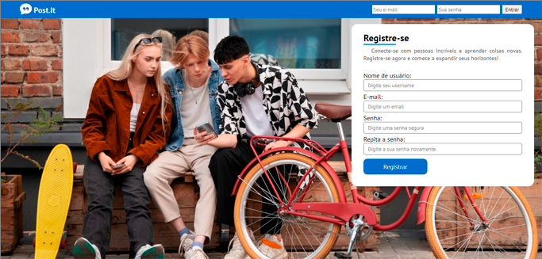
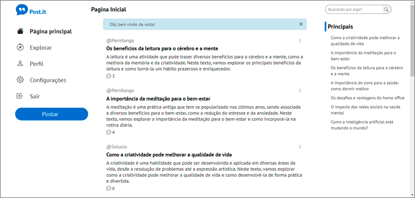
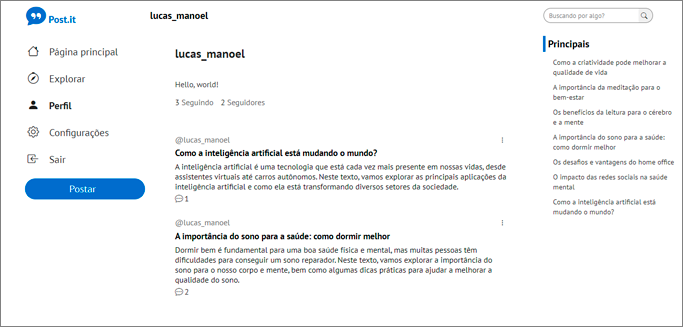
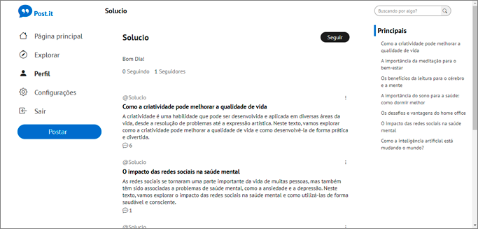
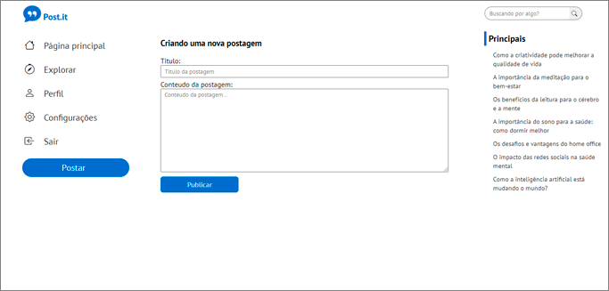
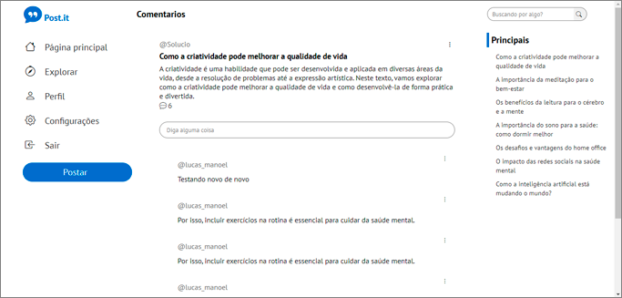
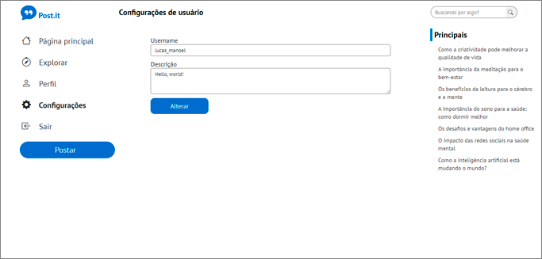
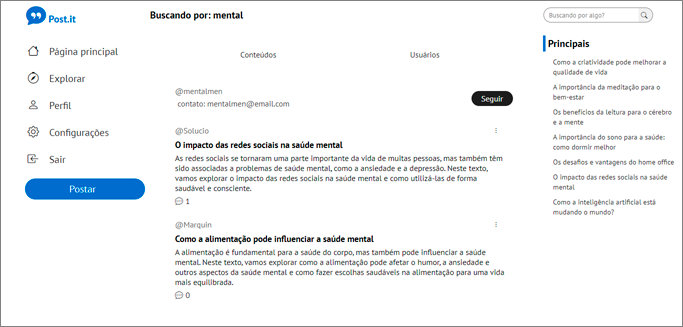

# post.it-twitter-simple-clone

Um clone simples do Twitter com publicação apenas de texte com fins meramente educativo, utilizando Express, Sequelize, e Handlebars utilizando o padrão MVC

## Print Screens do projeto

### Página de login e registro

### Página principal

### Página de usuário

### Página de outros usuários

### Página de criação de postagens

### Página de comentários

### Página de configurações de usuário

### Página de busca

